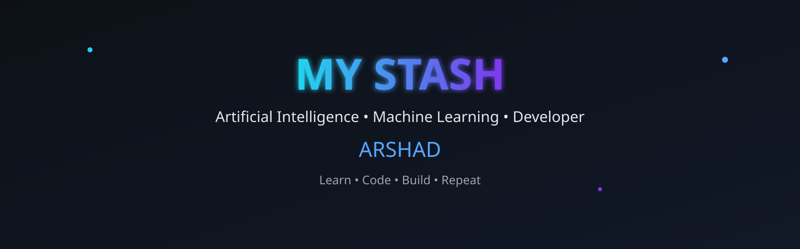
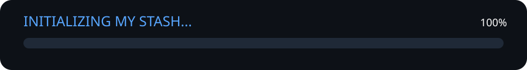
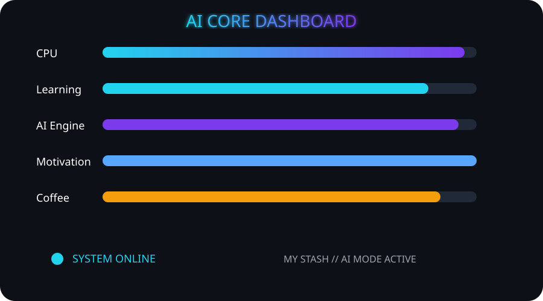
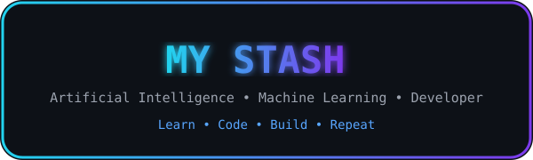

<div align="center">



<br>


<br><br>


</div>

---

# 👋 Hey, I'm Arshad

<table>

<tr>

<td width="60%" valign="top">

### 💻 About Me

- 🎓 Computer Science Engineering Student
- 🤖 Aspiring AI & Machine Learning Engineer
- 🌱 Currently learning **Node.js, Git, TensorFlow, PyTorch & OpenCV**
- 🚀 Building projects that solve real-world problems using AI
- ☕ Fueled by coffee and curiosity

---

### 🎯 Motto

```text
Learn.
Code.
Build.
Repeat.
```

---

### ⚡ Quick Facts

- 🌍 Based in India
- 💡 Loves AI, Computer Vision & Automation
- 📚 Always learning something new
- 🚀 Dream: Become a world-class AI Engineer

</td>

<td align="center">


</td>

</tr>

</table>

---


# 💻 MY STASH TERMINAL


---

# 🚀 TECH ARSENAL

<div align="center">

### 💻 Languages


<br><br>

### 🌐 Frontend


<br><br>

### ⚙ Backend


<br><br>

### 🗄 Database


<br><br>

### 🤖 AI / ML


<br><br>

### 🛠 Tools


</div>

---


# 📚 CURRENTLY TRAINING

```text
╔════════════════════════════════════════════════════════╗
║                   LEARNING DASHBOARD                  ║
╠════════════════════════════════════════════════════════╣
║                                                        ║
║  Node.js        ███████░░░░░ 45%                      ║
║  Git            ████████░░░░ 55%                      ║
║  TensorFlow     █████░░░░░░░ 35%                      ║
║  PyTorch        ████░░░░░░░░ 30%                      ║
║  OpenCV         █████░░░░░░░ 40%                      ║
║                                                        ║
║  STATUS : KEEP LEARNING 🚀                            ║
║                                                        ║
╚════════════════════════════════════════════════════════╝
```

---

# 🎯 MISSION

```text
[██████████] Python

[████████░░] SQL

[███████░░░] React

[█████░░░░░] Machine Learning

[███░░░░░░░] Deep Learning

[██░░░░░░░░] Open Source

[░░░░░░░░░░] AI Internship

MISSION STATUS

Learning...
Building...
Growing...
```

---

<div align="center">



</div>

---


# 📂 PROJECT ARCHIVE

<div align="center">

| 🌍 EcoVitals AI | 🤟 Hand Sign Language Detection | 🌱 Carbon Credit Fraud Detection |
|:---------------:|:-------------------------------:|:--------------------------------:|
| AI-powered platform combining environmental data with health intelligence. | Real-time sign language recognition using AI, OpenCV & MediaPipe. | Detecting fraudulent carbon credits using Machine Learning & data verification. |

</div>

---

# 🧠 AI CORE

<div align="center">



</div>

---

# ⚡ DEVELOPMENT JOURNEY

```text
                     2026 ROADMAP

Python            ██████████ 100%

SQL               ████████░░ 80%

React             ██████░░░░ 60%

Machine Learning  █████░░░░░ 50%

Deep Learning     ███░░░░░░░ 30%

Open Source       ██░░░░░░░░ 20%

AI Internship     ░░░░░░░░░░ 0%

----------------------------------------------

Current Status

✔ Learning

✔ Building

✔ Improving

✔ Never Giving Up
```

---


# 📊 GITHUB ANALYTICS

<div align="center">


</div>

<br>

<div align="center">


</div>

---

# 📈 CONTRIBUTION GRAPH

<div align="center">


</div>

---

# 🏆 GITHUB TROPHIES

<div align="center">


</div>

---

# 🐍 CONTRIBUTION SNAKE

<div align="center">

<picture>

<source media="(prefers-color-scheme: dark)"
srcset="https://raw.githubusercontent.com/arshadshaik094-tech/arshadshaik094-tech/output/github-contribution-grid-snake-dark.svg"/>

<source media="(prefers-color-scheme: light)"
srcset="https://raw.githubusercontent.com/arshadshaik094-tech/arshadshaik094-tech/output/github-contribution-grid-snake.svg"/>


</picture>

</div>

---

# ⚙ LIVE SYSTEM STATUS

```text
╔════════════════════════════════════════════════════════════╗
║                                                            ║
║                 MY STASH // SYSTEM STATUS                  ║
║                                                            ║
╠════════════════════════════════════════════════════════════╣
║                                                            ║
║ AI MODE            ████████████████                        ║
║                                                            ║
║ Python             ███████████████                         ║
║                                                            ║
║ Machine Learning   ██████████░░░                           ║
║                                                            ║
║ Coffee             █████████████                           ║
║                                                            ║
║ Motivation         ████████████████                        ║
║                                                            ║
║ Status             ONLINE                                  ║
║                                                            ║
╚════════════════════════════════════════════════════════════╝
```

---

<div align="center">


</div>

---


# 🌐 CONNECT WITH ME

<div align="center">

<a href="https://github.com/arshadshaik094-tech">

</a>

<a href="https://www.linkedin.com/in/shaheed-arshad/">

</a>

<a href="https://instagram.com/justzzz_arshad_">

</a>

</div>

---

# 💭 DAILY REMINDER

<div align="center">


</div>

---

# 💻 TERMINAL

```text
arshad@my-stash:~$ whoami

Arshad

Computer Science Student

Aspiring AI & Machine Learning Engineer

--------------------------------------------

arshad@my-stash:~$ goals

✔ Build impactful AI Projects

✔ Contribute to Open Source

✔ Master Machine Learning

✔ Keep Learning Every Day

--------------------------------------------

arshad@my-stash:~$ motto

Learn.
Code.
Build.
Repeat.

--------------------------------------------

arshad@my-stash:~$ fun_fact

Coffee.exe keeps me running ☕

--------------------------------------------

arshad@my-stash:~$ logout

Thanks for visiting My Stash.

Have an awesome day 👋
```

---

<div align="center">

# ⚡ MY STASH



</div>

---

<div align="center">

### 🚀 Thanks for visiting!


</div>

---

<div align="center">

### ⭐ If you like my work,

### consider following me and checking out my repositories.

<br>


</div>

<!--

█████████████████████████████████████████████████████

          Welcome to My Stash

      Learn • Code • Build • Repeat

     Thanks for reading the source! 😄

█████████████████████████████████████████████████████

-->
